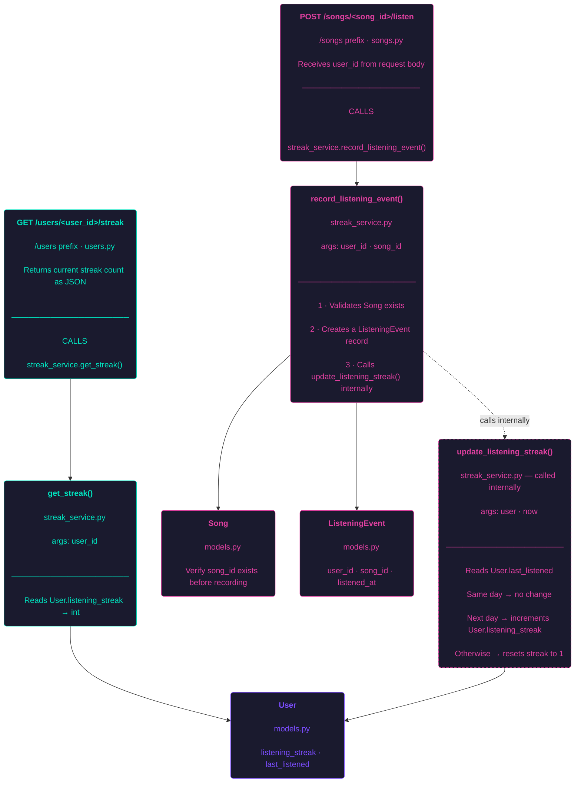

# Mixtape — Submission

## Codemap

### Main files
* **app.py** - The app is created here and route blueprints are registered.
* **Routes** - Contain the blueprint route endpoints for fetching/posting data.  Calls services when needed.
    * **feed.py** - Implements the endpoints needed for the user's feed.
    * **playlist.py** - Implements the endpoints needed for the user's playlists and the notification service mostly via songs endpoint.
    * **songs.py** - Implements the endpoints for user search, notification, streak, rate and details.
    * **users.py** - Implements the endpoints for user profile, GET streak and GET notifications.

* **Services** - Contain the logic for the app, utilizing the route endpoints when necessary to perform database operations.
    * **feed_service.py** - Implements logic for user's activity feed and friends current listening.
    * **notification_service.py** - Houses all of the logic for notification features such as; when a user rates a song, when a user adds to their playlist, counting notifications as read.
    * **playlist_service.py** - Houses the logic for playlists including getting a users playlist, adding a song to a playlist, getting the songs themselves from the playlist.
    * **search_service.py** - Houses the logic for searching for songs and getting song details.
    * **streak_service.py** - Houses the logic for user streaks including recording listening events and updating streaks.

* **Models.py** - Contains the database models and join tables.
    **Models**
    * **User** - Represents a registered user and stores their username, email, listening streak, timestamp of last listen Has relationships songs they've shared, ratings, listening events, notifications, playlists, and friends.
    * **Song** - Represents a song shared by a user and stores its title, artist, album, genre, who shared it, when it was shared, and an optional share note. Has relationships to ratings, listening events, and tags.
    * **Tag** - Represents a genre or mood label that can be applied to songs. Stores only a unique name.
    * **ListeningEvent** - Represents a record of a user listening to a song and stores the user, the song, and the timestamp of when it was listened to. Used to drive streak calculations and the social feed.
    * **Rating** - Represents a user's numeric score (1–5) for a song and stores the user, the song, the score, and when it was rated. A user can only rate a given song once.
    * **Playlist** - Represents a named collection of songs created by a user and stores the name, the creator, when it was created, and whether it is collaborative. Has a relationship to songs through playlist_entries.
    * **Notification** - Represents an in-app message delivered to a user and stores the type, body text, read status, and timestamp. Generated when a user rates a song or adds a song to a playlist.

    **Join Tables**
    * **friendships** - A self-referential M:M join on the User table. Links user_id to friend_id, both pointing back to the user table. Powers the social feed.
    * **song_tags** - A M:M join between Song and Tag. Links song_id to tag_id. Powers tag-based song search and filtering.
    * **playlist_entries** - A M:M join between Playlist and Song. Also stores position (track ordering), who added the song, and when it was added.

```mermaid
graph TD
    %% ── Styles ────────────────────────────────────────────────────────────
    classDef entrypoint fill:#b5890a,stroke:#b5890a,color:#fff
    classDef route      fill:#1a1a2e,stroke:#e040a0,color:#e040a0
    classDef service    fill:#1a1a2e,stroke:#00e5c0,color:#00e5c0
    classDef model      fill:#1a1a2e,stroke:#7c4dff,color:#7c4dff
    classDef support    fill:#2a2a2a,stroke:#555,color:#aaa

    %% ══════════════════════════════════════════════════════════════════════
    %% 00 · ENTRY POINT
    %% ══════════════════════════════════════════════════════════════════════
    APP("<b>app.py</b><br/>
    db = SQLAlchemy() — shared handle every model &amp; service imports<br/>
    create_app() — factory: config → sqlite, SECRET_KEY, db.init_app()<br/>
    Registers 4 blueprints → /songs, /playlists, /users, /feed<br/>
    db.create_all() on startup · runs with debug=True when executed directly")

    class APP entrypoint

    %% ══════════════════════════════════════════════════════════════════════
    %% 01 · ROUTES
    %% ══════════════════════════════════════════════════════════════════════
    SONGS_R("<b>/songs · songs.py</b><br/>
    search, detail, rate, listen<br/>
    ─────────────────────<br/>
    GET  /search<br/>
    GET  /&lt;id&gt;<br/>
    POST /&lt;id&gt;/rate<br/>
    POST /&lt;id&gt;/listen<br/>
    ─────────────────────<br/>
    IMPORTS<br/>
    search_service<br/>
    notification_service<br/>
    streak_service")

    PLAYLISTS_R("<b>/playlists · playlists.py</b><br/>
    create, detail, songs, add<br/>
    ─────────────────────<br/>
    POST /<br/>
    GET  /&lt;id&gt;<br/>
    GET  /&lt;id&gt;/songs<br/>
    POST /&lt;id&gt;/songs<br/>
    ─────────────────────<br/>
    IMPORTS<br/>
    playlist_service<br/>
    notification_service")

    USERS_R("<b>/users · users.py</b><br/>
    profile, streak, notifications<br/>
    ─────────────────────<br/>
    GET  /&lt;id&gt;<br/>
    GET  /&lt;id&gt;/streak<br/>
    GET  /&lt;id&gt;/notifications<br/>
    POST /notifications/&lt;id&gt;/read<br/>
    ─────────────────────<br/>
    IMPORTS<br/>
    streak_service<br/>
    notification_service<br/>
    User")

    FEED_R("<b>/feed · feed.py</b><br/>
    listening-now, activity<br/>
    ─────────────────────<br/>
    GET /&lt;id&gt;/listening-now<br/>
    GET /&lt;id&gt;/activity<br/>
    ─────────────────────<br/>
    IMPORTS<br/>
    feed_service")

    class SONGS_R route
    class PLAYLISTS_R route
    class USERS_R route
    class FEED_R route

    %% ══════════════════════════════════════════════════════════════════════
    %% 02 · SERVICES
    %% ══════════════════════════════════════════════════════════════════════
    SEARCH_S("<b>search_service.py</b><br/>
    search_songs()<br/>
    get_song()<br/>
    ─────────────────────<br/>
    TOUCHES<br/>
    Song · Tag · song_tags")

    STREAK_S("<b>streak_service.py</b><br/>
    record_listening_event()<br/>
    update_listening_streak()<br/>
    get_streak()<br/>
    ─────────────────────<br/>
    TOUCHES<br/>
    User · ListeningEvent")

    NOTIF_S("<b>notification_service.py</b><br/>
    create_notification()<br/>
    add_to_playlist()<br/>
    rate_song()<br/>
    get_notifications()<br/>
    mark_as_read()<br/>
    ─────────────────────<br/>
    TOUCHES<br/>
    Notification · Song · User<br/>
    Rating · Playlist")

    PLAYLIST_S("<b>playlist_service.py</b><br/>
    create_playlist()<br/>
    get_playlist_songs()<br/>
    get_playlist()<br/>
    get_user_playlists()<br/>
    ─────────────────────<br/>
    TOUCHES<br/>
    Playlist · Song · User<br/>
    playlist_entries")

    FEED_S("<b>feed_service.py</b><br/>
    get_friends_listening_now()<br/>
    get_activity_feed()<br/>
    ─────────────────────<br/>
    TOUCHES<br/>
    User · Song · ListeningEvent<br/>
    friendships")

    class SEARCH_S service
    class STREAK_S service
    class NOTIF_S service
    class PLAYLIST_S service
    class FEED_S service

    %% ══════════════════════════════════════════════════════════════════════
    %% 03 · MODELS
    %% ══════════════════════════════════════════════════════════════════════
    MODELS("<b>models.py</b><br/>
    User · Song · Tag · ListeningEvent · Rating · Playlist · Notification<br/>
    friendships M:M · song_tags M:M · playlist_entries M:M<br/>
    ─────────────────────────────────────────────────────<br/>
    7 models + 3 association tables · UUID string PKs · UTC timestamps<br/>
    Each model has to_dict() for JSON serialization")

    class MODELS model

    %% ══════════════════════════════════════════════════════════════════════
    %% + SUPPORT FILES
    %% ══════════════════════════════════════════════════════════════════════
    SEED("seed_data.py<br/>Populates the DB — users,<br/>songs, tags, playlists,<br/>ratings, friendships")
    TEST_SEARCH("tests/test_search.py<br/>pytest — search behavior")
    TEST_STREAK("tests/test_streaks.py<br/>pytest — streak logic")
    TEST_PLAYLIST("tests/test_playlists.py<br/>pytest — playlist behavior")
    REQUIREMENTS("requirements.txt<br/>Flask, Flask-SQLAlchemy, pytest")
    DB_FILE("instance/mixtape.db<br/>SQLite database file")

    class SEED support
    class TEST_SEARCH support
    class TEST_STREAK support
    class TEST_PLAYLIST support
    class REQUIREMENTS support
    class DB_FILE support

    %% ══════════════════════════════════════════════════════════════════════
    %% EDGES — top-to-bottom request flow
    %% ══════════════════════════════════════════════════════════════════════

    %% Entry point → Routes
    APP --> SONGS_R
    APP --> PLAYLISTS_R
    APP --> USERS_R
    APP --> FEED_R

    %% Routes → Services
    SONGS_R     --> SEARCH_S
    SONGS_R     --> NOTIF_S
    SONGS_R     --> STREAK_S
    PLAYLISTS_R --> PLAYLIST_S
    PLAYLISTS_R --> NOTIF_S
    USERS_R     --> STREAK_S
    USERS_R     --> NOTIF_S
    FEED_R      --> FEED_S

    %% Service → Service calls — non-obvious wiring
    STREAK_S   -.->|"record_listening_event() calls update_listening_streak() internally"| STREAK_S
    NOTIF_S    -.->|"rate_song() calls create_notification() to alert the song's sharer"| NOTIF_S
    PLAYLIST_S -.->|"add_to_playlist() imports playlist_service + calls create_notification()"| NOTIF_S

    %% Services → Models
    SEARCH_S   --> MODELS
    STREAK_S   --> MODELS
    NOTIF_S    --> MODELS
    PLAYLIST_S --> MODELS
    FEED_S     --> MODELS

    %% Support — not in the request path
    MODELS -.-> SEED
    MODELS -.-> TEST_SEARCH
    MODELS -.-> TEST_STREAK
    MODELS -.-> TEST_PLAYLIST
    APP    -.-> REQUIREMENTS
    APP    -.-> DB_FILE
```

### Data Flow 2 — Listening & Streaks

`POST /songs/{song_id}/listen` writes and updates the streak; `GET /users/{user_id}/streak`
only reads.

Specifically to update the streak we have the following data flow:
`POST /songs/{song_id}/listen` (uses the `songs.py` route file; `song_id` comes from the URL path, `user_id` from the request body) →
`record_listening_event()` in `streak_service.py` is called →
`update_listening_streak()` in `streak_service.py` is called internally →
returns the new `ListeningEvent` record as JSON (201).

### Patterns

1. **Separation of Concerns:** - Each layer (routes, services, models) stay self-contained, with clearly defined responsibilities. Routes only parse/validate requests and format responses. All of the logic is found in the services. Models only define schema and serialization.

2. **Routes are Self-contained** - Much like the layers themselves each route blueprint (songs, playlists, users, feed) is self-contained within the corresponding file for that route.

3. **Model Default PK** - Each model utilizes UUID for it's primary key as opposed to incremental integers.

## 📋 Root Cause Analysis of Bugs

### First Bug:
1. **Issue number and title:**
#1 - "My listening streak keeps resetting"

2. **How you reproduced it** — What steps did you take to confirm the bug exists before touching any code? What inputs, sequence of actions, or data condition triggered the behavior?

   After seeding the database (`python seed_data.py`), I confirmed the `/users/<id>/streak` endpoint returned kenji's streak of 12. To replicate the exact state described, I used `sqlite3` to set `last_listened_at` to a Saturday (`2024-06-15 20:00:00`) and `listening_streak` to 12 directly in the database. I then temporarily set the system clock to Sunday June 16, 2024 and hit `POST /songs/<song_id>/listen` with kenji's user ID. Checking the streak endpoint immediately after returned `1` instead of `13`. Repeating the same experiment with a Friday → Saturday transition (same gap, different days) returned the correct incremented value, which confirmed the reset was specific to Sunday and not a general off-by-one in the date comparison.

3. **How you found the root cause** — Which files did you look at? What was your navigation path? What moment made you confident you'd found the right place — not just a suspicious area, but the specific cause?

    Since the issue was with the user's streak I immediately went searching in streak_service.py specifically looking for logic related to dates or days. I knew I was in the general area of the bug when I hit `last_date = last_listened.date()`. I knew I had found the bug itself when I reached `elif days_since_last == 1 and today.weekday() != 6:` before I even fully read through and understood the logic. I knew something was off about this part. Asking myself, "Why would this need `and`?" Then thinking on it further, hypothesizing that it were Saturday and the code just ran, well, the logic would automatically go to the next `else` statement found.

4. **The root cause** — In plain English, explain exactly what was wrong. Not "there was a bug in the streak logic" — explain the specific condition, comparison, or missing step that caused the problem.

    The issue was with the fact that the code reads out 'if days last since = 1 AND today is not day 6`. Meaning that even if someone's streak was 1, if they were adding to the streak on Saturday (day 6 of the week) it would default to the next else and restart their streak.

5. **Your fix and side-effect check** — What did you change and why does that change fix the root cause? What related functionality did you check afterward to confirm you didn't break anything?

    This was a very simple fix. All I had to do was remove the `and today.weekday() != 6` portion of line 73 in `streak_service.py`. The logic will still work correctly without adding anything else to that line. It only needs to know how many days since, not what day it is or isn't. I then ran `pytest tests/test_streaks.py::test_streak_increments_on_sunday -v` and ` pytest tests/test_streaks.py -v` first to ensure that nothing was broken via testing. Then, I ran each of the individual tests to ensure that they all still worked as expected.